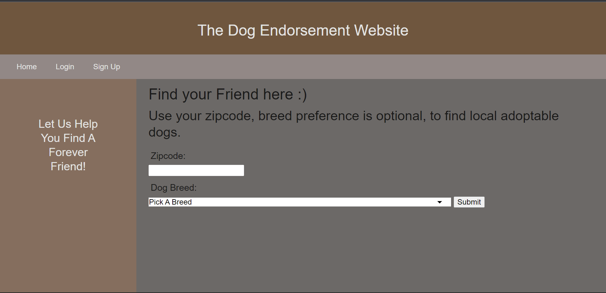
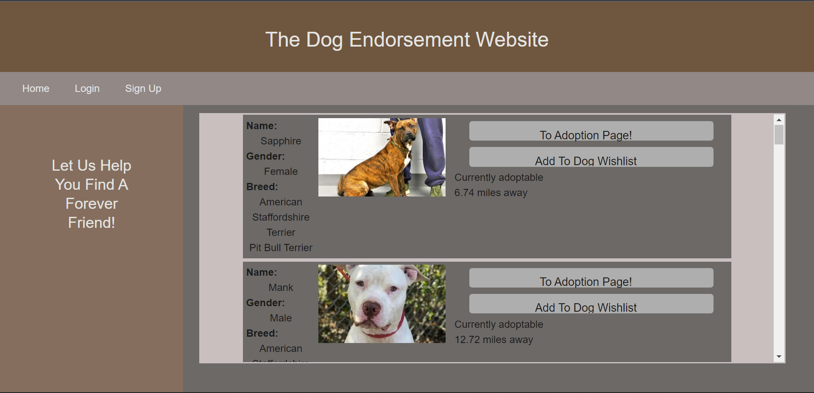

# DogEndorsementWebsite

## Description
The Dog Endorsement Website makes filtering, finding and reffering back to adoptable dogs near you simple! 

## Table of Contents
- [Installation](#installation)
- [Usage](#usage)
- [Screenshots](#screenshots)
- [Resources](#resources)
- [Contributors](#resources)

## Installation
The application needs the MySql2, Express, Sequalize and dotenv packages to function

## Usage
The website needs these packages to run: bcrypt, connect-session-sequelize, dotenv, express, express-handlebars, express-session, mysql2, node-fetch, sequelize.

## Screenshots

## Contributors
Isaac:
- Checkout my [Github here](https://github.com/IsaacJCarnes)
Tasnim:
- Checkout my [Github here](https://github.com/tasnim123)
Paul:
- Checkout my [Github here](https://github.com/Orbit001)

## Resources
Dog adoption data is gathered from the petfinder api.